# Soteria

### We won [Best Solution](https://devpost.com/software/soteria-yolciw) to [AWS Disaster Response Hackathon](https://awsdisasterresponse.devpost.com/)! 🥳
### Featured in [Amazon re:MARS 2022 - Improving disaster response with machine learning](https://youtu.be/Qo5g2i7fQMo)

## Soteria uses machine learning with satellite imagery to map natural disaster impacts for faster emergency response. 

Youtube Demo: https://youtu.be/frjIm_FDlhc   
Devpost Home page: https://devpost.com/software/soteria-yolciw  
Hugging Face ML Demo: https://huggingface.co/spaces/samt/soteria  
Figma Prototype: [link](https://www.figma.com/file/V1VryEK3uac6WuxU87zQmW/Soteria---AI-for-NDR?node-id=0%3A1)   
Presentation Slides: [link](https://docs.google.com/presentation/d/1jU2ZUkhJnA-4_aBZwyvP9bfCBZsQZwaYSPLROFvgByc/edit?usp=sharing)

### ML Models
Binary Damage Classification:   
Disaster Type Classification:   
Regional Damage Level Classification: 

## Our Team
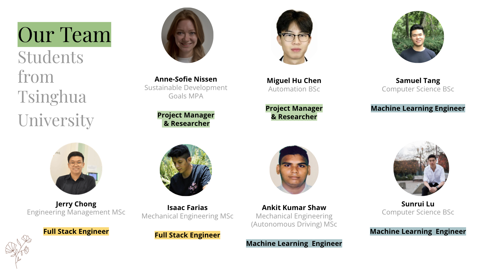

## Background
The scale, scope and intensity of natural disasters ranging from hurricanes to wildfire is only increasing as the effects of climate change worsen. The lives lost and impacted continue to highlight peoples vulnerability to these disastrous events. As a team, we wanted to use our areas of interest and expertise to serve communities who have or will be impacted by natural disasters. We don’t need to be on the ground of a disaster to make an impact. Inspired by the potential that AI has for improving the quality of life, we applied this to natural disasters. We wanted our model to be applicable to all natural disaster globally, but first we start on the East coast of Malaysia.
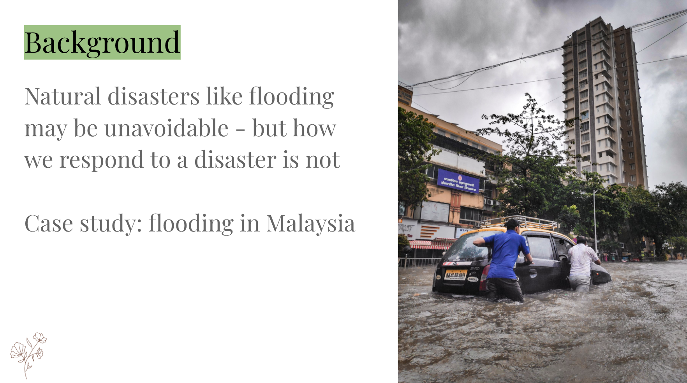

## Our Project 
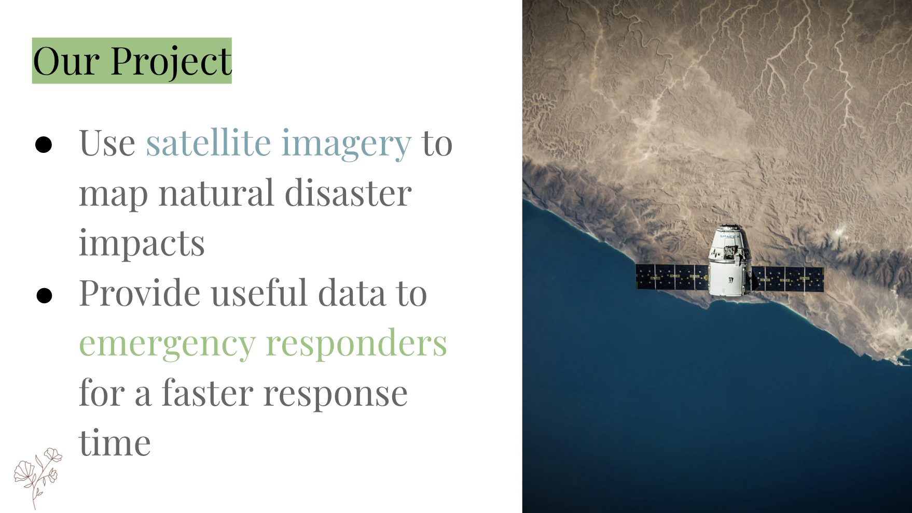
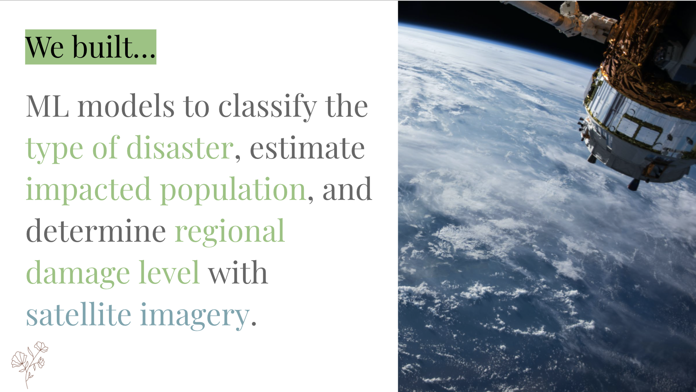

## Technologies 
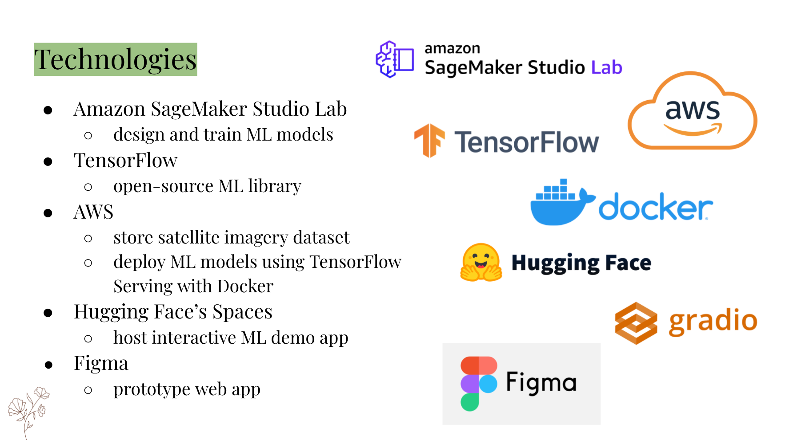

## Machine Learning
### Dataset 
Download: https://xview2.org/
Learn more: https://arxiv.org/abs/1911.09296
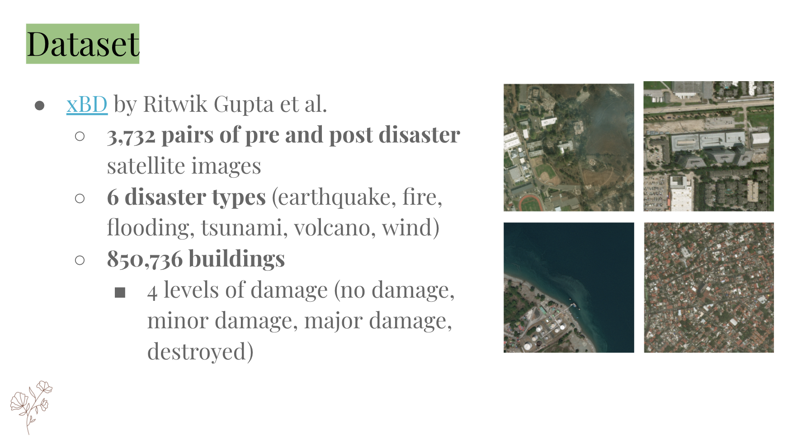

### Models
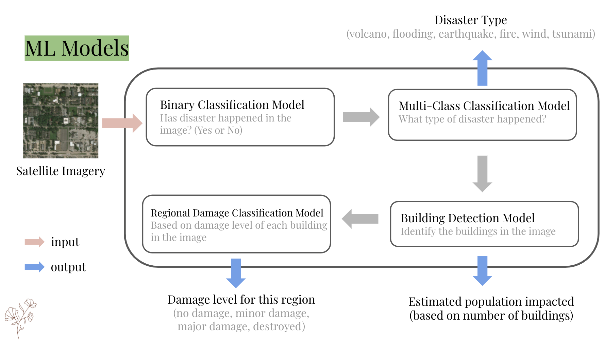

## Figma Prototype
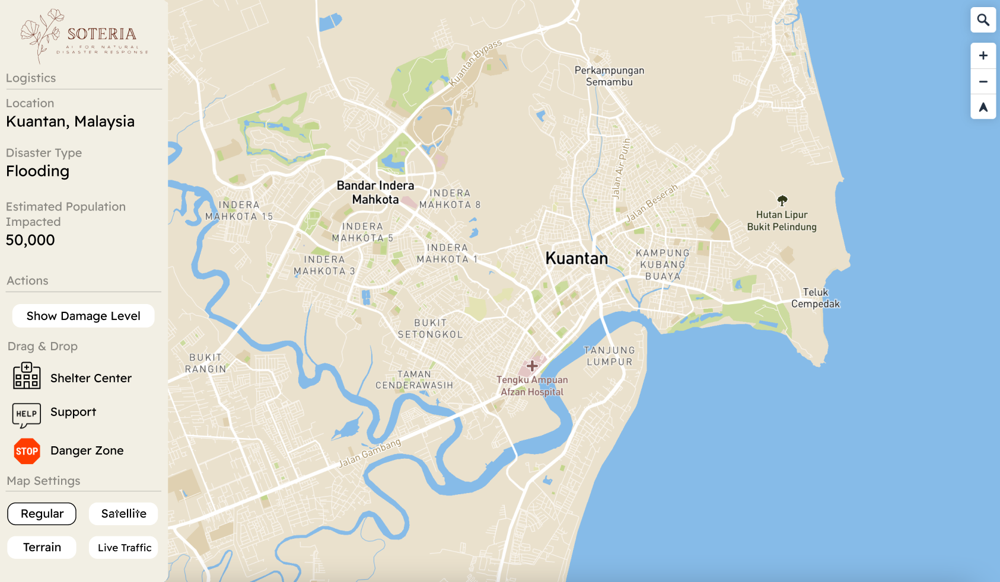
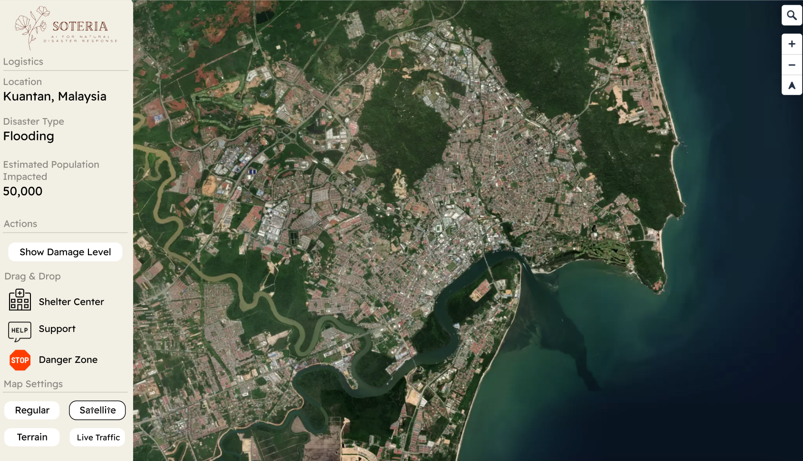
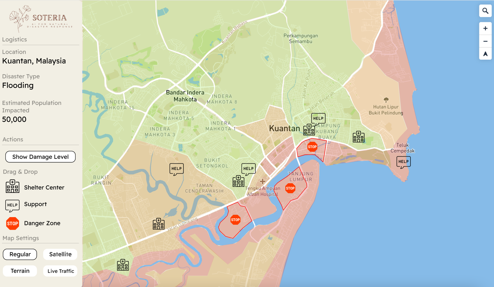
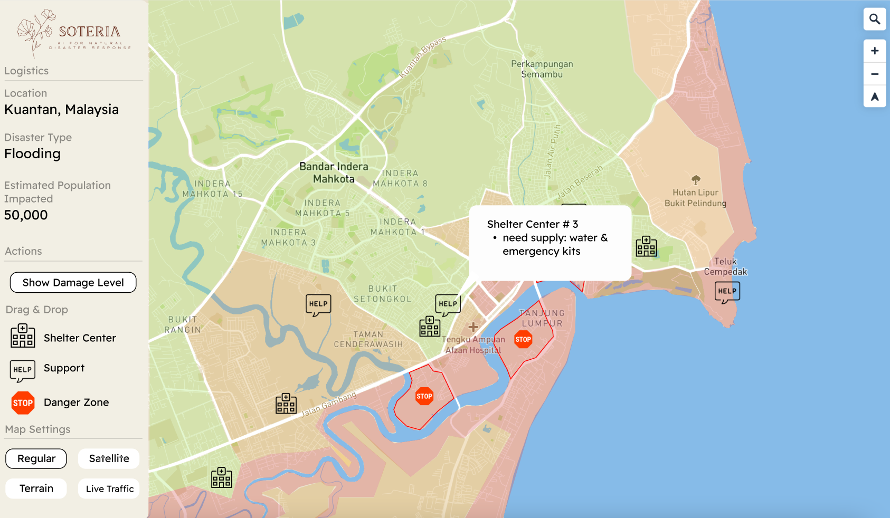

## Inspirations/Resources
* [AI For Good — Disaster Response by Shairoz Sohail](https://medium.com/geoai/ai-for-good-disaster-response-3e0669dfc038)
* [PEER HUB IMAGENET  Φ-NET](https://apps.peer.berkeley.edu/phi-net/)
* [Building Damage Detection in Satellite Imagery Using
Convolutional Neural Networks by Google](https://storage.googleapis.com/pub-tools-public-publication-data/pdf/0d65915acc9ff4d6dcbe53b82742c8da8c9d1fbd.pdf)
* [Structural Damage Image Classification](https://cs229.stanford.edu/proj2018/report/39.pdf)
